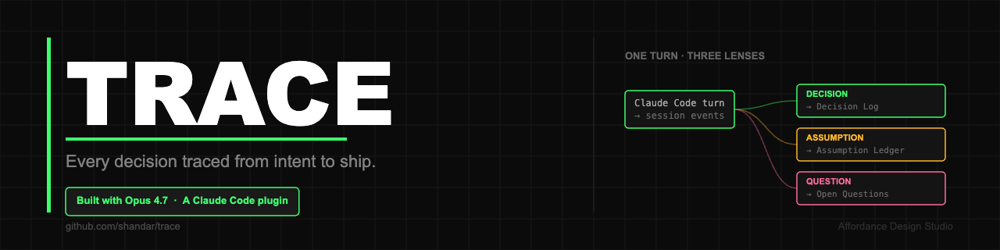

<p align="center">
  
</p>

# TRACE

**Every decision traced from intent to ship.**

TRACE is a Claude Code plugin that turns your PRD into a living document. You scaffold intent at the start of a project. Claude Code executes against it, and the PRD writes itself back — logging decisions, surfacing contradicted assumptions, flagging new open questions as the build progresses. At the end of the session, the document matches what shipped, not what you hoped.

Built for the [Built with Opus 4.7 hackathon](https://cerebralvalley.ai/e/built-with-4-7-hackathon).

---

## How it works

TRACE runs as a set of Claude Code hooks:

1. **PostToolUse** captures every tool event into a per-session log.
2. **Stop** (fires after every turn) triggers a proposer that synthesizes the turn into proposed PRD edits.
3. The proposer runs **three Opus 4.7 sub-agents in parallel**, each reading the same events through a different lens:
   - **Decision** → Decision Log
   - **Assumption** → Assumption Ledger
   - **Question** → Open Questions
4. Proposals with confidence ≥ 0.5 land in `.trace/pending.jsonl`.
5. `trace-prd review` shows each proposal one at a time. `[a]` writes it into the right section of `TRACE.md`. `[s]` skips.

Pure read-only turns produce no proposals. Each turn is watermarked, so the same events are never synthesized twice.

---

## Requirements

- **Node.js ≥ 18** (ESM modules)
- **[Claude Code](https://docs.claude.com/en/docs/claude-code)** — the CLI must be installed and working
- **Anthropic API key** — separate from your Claude.ai/Max subscription. Hooks run as subprocesses and need an API key in their environment, not OAuth credentials.

---

## Install

```bash
# 1. Clone and build
git clone https://github.com/shandar/trace.git
cd trace
npm install
npm run build

# 2. Symlink the CLI globally
npm link

# 3. Export your Anthropic API key in your shell rc file
echo 'export ANTHROPIC_API_KEY=sk-ant-...' >> ~/.zshrc
source ~/.zshrc

# 4. Verify
trace-prd --version
```

> **Important:** the API key must be exported in the shell *before* you launch Claude Code. The hook subprocesses inherit the environment from whatever shell launched `claude`.

---

## Quickstart

In any project directory where you want a living PRD:

```bash
trace-prd init
```

This scaffolds a structured `TRACE.md` with section headers (Intent, Users & jobs-to-be-done, In scope, Out of scope, Open Questions, Decision Log, Assumption Ledger). Open it and fill in the **Intent** section — what you're building and why.

> **Hook activation note (current limitation):** the Claude Code hooks that drive TRACE are configured in this repo's `.claude/settings.json`. To activate them in another project, copy that folder into your target project's root: `cp -r path/to/trace/.claude /path/to/your-project/`. Future versions of `trace-prd init` will do this automatically.

Then start building with Claude Code as normal. Every turn produces proposals in `.trace/pending.jsonl`. Review them with:

```bash
trace-prd review
```

That's the whole loop.

---

## Project layout

```
trace/
├── TRACE.md                     This repo's own living PRD — written by TRACE
├── SUBMISSION.md                Hackathon submission description
├── src/
│   ├── cli.ts                   CLI entry (init, review subcommands)
│   ├── event-logger.ts          PostToolUse hook — appends events to session log
│   ├── session-proposer.ts      Stop hook — runs the 3-lens synthesizer
│   └── review.ts                trace-prd review command + section writer
├── .claude/
│   └── settings.json            Hook registration for PostToolUse + Stop
├── .trace/
│   ├── sessions/                Per-session event logs (one .jsonl per session_id)
│   └── pending.jsonl            Queue of proposed edits awaiting review
├── package.json
├── tsconfig.json
└── LICENSE
```

---

## The recursive proof

This repo's `TRACE.md` was written by TRACE itself.

Commit [`797daaf`](https://github.com/shandar/trace/commit/797daaf) is the first moment TRACE used TRACE to document itself — a Decision Log entry written by the hook, vetted through the review loop, committed to `main`. Every subsequent entry in the `## Decision Log`, `## Assumption Ledger`, and `## Open Questions` sections followed the same path.

Read `TRACE.md` in this repo to see what a living PRD actually looks like in the wild.

---

## Built with

- **Claude Code** — hook runtime, sub-agent orchestration, development environment
- **Opus 4.7** — three specialist sub-agents (decision, assumption, question) running in parallel per turn
- **TypeScript** on Node.js

---

## Known limitations

This is a 6-day hackathon prototype. Open issues:

- `trace-prd init` does not yet copy hook config into the target project — see Quickstart for the manual step.
- Hardcoded paths in `.claude/settings.json` need to be made portable.
- No `--help` output for individual subcommands.
- macOS only tested. Linux likely works, Windows untested.

---

## Author

Shandar Junaid — UX designer turned AI product builder.
[Affordance Design Studio](https://affordance.design)

Most of the code in this repo was written by Claude Code under direction. The product calls, the architecture decisions, the demo story, and this README are mine.

---

## License

MIT. See [LICENSE](./LICENSE).
